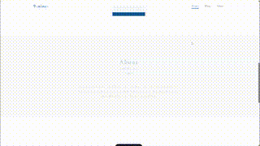
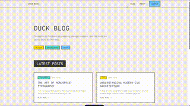

# style-extractor

从真实网页里提取颜色、字体、间距、组件状态和动效证据，最后整理成一套可复用的风格参考文档。

目标不是复刻原站，而是沉淀可复用的视觉语言、交互规则和证据链。

## 演示

| 9-nine | MotherDuck |
|:--:|:--:|
|  |  |

## 这是什么

这是一个给 AI agent 用的 skill 仓库。

它会让 agent：
1. 打开真实网页
2. 截图、抓 computed style、下载 CSS/JS
3. 在有动效时补运行时证据
4. 输出风格指南、动效附录和证据清单

## 依赖

- Node.js（能运行 `npx`）
- Chrome（Stable）
- Codex CLI 或其他支持 MCP 的客户端
- `chrome-devtools-mcp`

`chrome-devtools-mcp` 是必须的，因为这个 skill 的核心能力就是操作真实浏览器、抓网络请求、截图、跑页面内脚本、必要时录 trace。

## 安装

1. 下载这个仓库
2. 放到 skills 目录里，推荐放在 `public`
3. 确认目录下至少有 `SKILL.md`、`references/`、`scripts/`

例如：

```text
C:\Users\<You>\.codex\skills\public\style-extractor\
```

## 使用

直接在 Codex / Claude Code 里下类似这样的指令：

```text
帮我提取这个网页的风格：https://example.com
```

如果客户端没有自动命中，可以明确点名 `style-extractor`。

生成结果统一写到：

```text
%USERPROFILE%\style-extractor\<project>-<style>\
  guides\
    style-guide.md
    motion-guide.md
    evidence-manifest.md
  evidence\
    screenshots\
    assets\
    notes\
```

其中：
- `style-guide.md` 必有
- `evidence-manifest.md` 必有
- `motion-guide.md` 只在站点动效有意义时必有

## 参考内容

`references/` 里有三类东西：
- 输出契约：`output-contract.md`
- 文档模板：`style-guide-template.md`、`motion-guide-template.md`、`evidence-manifest-template.md`
- 参考包：`9nine-visual-novel/`、`motherduck-design-system-reference/`

做任何提取前，必须先读：
1. `references/output-contract.md`
2. 三个模板文件
3. `references/9nine-visual-novel/guides/` 下全部文档
4. `references/motherduck-design-system-reference/guides/` 下全部文档

不读完这一步，不应该开始抓证据或写最终文档。

## 原则

- 提取风格，不复制产品信息架构
- 输出必须带证据链，不能只写感觉
- 静态风格和动效分层交付
- 最终文档要能复用，不要写成产品拆解报告

## 仓库结构

```text
style-extractor/
├── README.md
├── SKILL.md
├── media/
├── references/
└── scripts/
```
